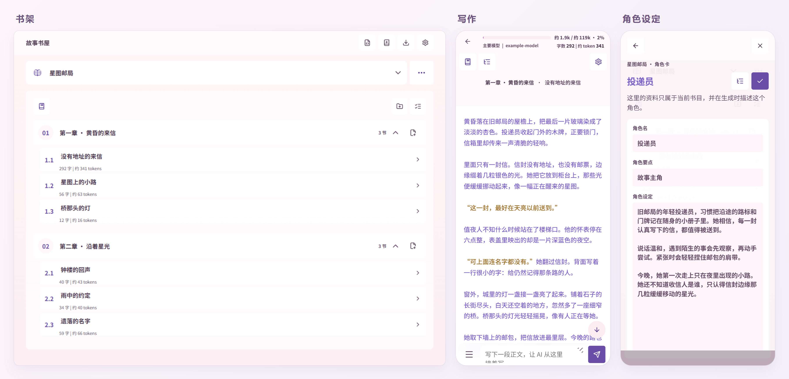

简体中文 | [English](README.en.md)

# Story Room · 故事书屋

一个把正文、角色和世界设定放在一起的本地故事写作空间。

从一个场景或几行文字开始，请 AI 接着写，再比较不同的续写候选，留下适合故事的一版。每本书都有独立的资料；你可以用作者模式推进情节，也可以选择角色，以第一人称参与故事。正文始终连贯地排在一起，方便阅读和修改。

这是早期 **Alpha**，当前界面为中文。欢迎试用，也请为重要作品保留独立备份。

## 把链接交给你的 Agent

把这个仓库链接发给能读取代码并操作本机的 AI Agent：

**https://github.com/beniedev/story-room**

它可以沿仓库入口找到[安装与使用指南](docs/AGENT_GUIDE.zh-CN.md)，检查你的系统和已有环境，获取代码、安装依赖、启动应用并打开网页。你不需要选择运行版本，也不需要先学习终端命令。

如果想说得更明确，可以直接发：

> 请帮我安装并启动 https://github.com/beniedev/story-room，然后指导我连接自己的 AI 服务，开始写作并保存备份。请先读仓库的 AGENTS.md 和安装指南，保留我已有的书稿与配置。

第一次连接 AI 时，Agent 会指导你在本机设置中填写可信服务的 URL、模型 ID 和 API Key。密钥由你在应用里输入，不需要发到聊天中。Story Room 不附带模型服务或订阅。

喜欢自己安装的话，步骤见[使用手册](docs/USER_GUIDE.zh-CN.md#安装与打开)。本项目使用 Node.js **22.x（至少 22.18.0）或 24.x** 和 npm。

## 界面预览

## 开始你的第一本书

1. 点“新建书目”，填写书名并确认。新书已经带有一个章节和小节。
2. 在“本书设定”里放好角色、世界观和剧情大纲，确认需要加载到哪些小节。
3. 打开小节，在底部写下几行文字，点“发送并续写”。可以编辑正文、尝试“再生成一版”，用候选箭头选择想采用的版本。
4. 在“选择前文”中为较早的小节保存梗概，决定本节需要参考哪些前文。生成前可查看“本轮上下文概览”。
5. 回到书架，用“导出当前书目”留下备份。

完整的按钮说明、作者与角色模式、目录整理和恢复步骤，都在[中文使用手册](docs/USER_GUIDE.zh-CN.md)；[英文手册](docs/USER_GUIDE.md)提供中文按钮对照。

## 书稿、AI 和备份

书稿保存在运行应用的电脑上，是可以读取的本地文件；“设置 → 保存位置”会显示书库目录。通过受信任网络从另一台设备访问时，书稿仍在运行服务的电脑上。应用没有云端书稿存储或自动同步。

生成时，应用会把**本轮上下文包含的写作材料**发送给你配置的模型服务，其中包括已确认并选中的前文梗概；请求还会带上书名、章名、小节标题等定位信息。本地优先描述的是书稿保存方式，不意味着真实 AI 请求始终留在设备内。密钥保存在单独的本地明文配置文件中，不放进书目备份。

已提交的正文修改会自动保存。**尚未发送或确认的编辑框内容，不一定在书目或 JSON 备份里**；离开前请检查保存状态，并另行保留尚未提交的文字。

- **EPUB、Markdown、TXT**：导出当前采用的正文，方便阅读或继续编辑。
- **JSON 完整备份**：保留书目资料、仍存在的候选、前文选择和梗概快照，适合恢复。导入会建立副本，不覆盖原书。

多个标签页可以编辑。同一本书发生保存冲突时，本页修改会保留，应用不会自动合并或覆盖新版本。处理方法见[保存与恢复](docs/USER_GUIDE.zh-CN.md#自动保存冲突和恢复)。保存事务不能替代独立备份。

## 当前边界与反馈

本地服务默认只接受本机访问，没有登录或访问密码。需要在其他设备上使用时，让 Agent 帮你配置受信任网络内的访问；能访问该地址的设备可以使用服务，不要直接开放到公网。

应用能恢复部分保存或删除中断，但不能保证抵御断电、磁盘损坏；不要让两份应用同时使用同一个书库目录。当前没有账号同步、多人协作或桌面安装包。CI 覆盖 Windows、macOS、Ubuntu 与 Node 22/24 的测试和构建，不代表每一种浏览器或模型服务都已实测。

欢迎提交带有虚构故事的小型复现，请不要附上私人书稿、备份或密钥。安全问题按[安全说明](SECURITY.md)联系维护者；数据与信任边界见[隐私说明](PRIVACY.md)和[威胁模型](docs/THREAT_MODEL.md)，这三份资料目前为英文。

开发检查与代码入口见 [Agent 指南](docs/AGENT_GUIDE.zh-CN.md#验证入口)。

## 许可证与第三方资源

项目代码采用 [MIT License](LICENSE)。可选的 LXGW WenKai Lite 字体遵循 [SIL Open Font License 1.1](public/fonts/OFL.txt)；其他资源归属见 [THIRD_PARTY_NOTICES.md](THIRD_PARTY_NOTICES.md)。
